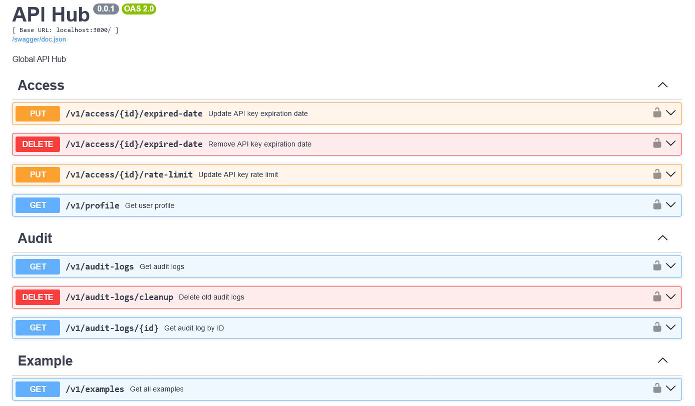
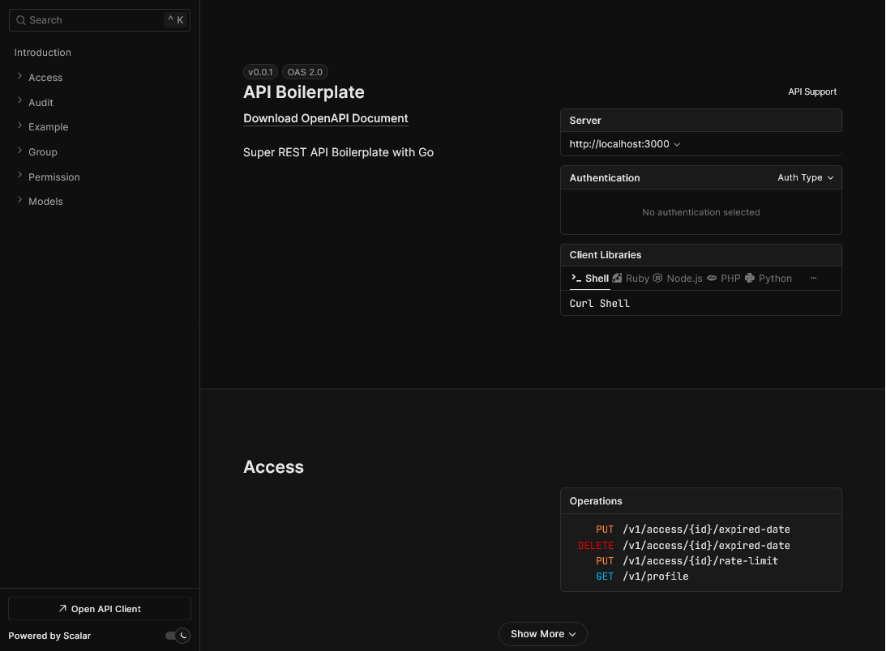

# 🧩 REST API Modular Boilerplate (Go)


## 📑 Table of Contents

- [🧩 Features](#-features)
- [🚀 Quickstart](#-quickstart)
- [📂 Project Structure](#-project-structure)
- [🧱 Architecture](#-architecture)
- [🛡️ Security & Auth](#-security--auth)
- [📈 Audit Logging System](#-audit-logging-system)
- [🔄 Status Management System](#-status-management-system)
- [⏳ API Key Expiration](#-api-key-expiration-system)
- [🚦 API Rate Limiting](#-api-rate-limiting-system)
- [🧪 Testing](#-testing)
- [🧩 Add New Module](#-add-new-module)
- [🧰 Development Tools](#-development-tools)
- [🗃️ Seeder & Test Data](#%EF%B8%8F-seeder--test-data)
- [📖 API Documentation](#-api-documentation)
- [🚀 Deployment](#-deployment)

[API Boilerplate Main Repo](https://github.com/luridarmawan/api-boilerplate-go)

## 🧩 Features

- ✅ **Modular Architecture**: Feature-based directory structure
- ✅ **Authentication System**: Bearer token with expiration & rate limiting
- ✅ **Expiration System**: Supports token/key expiration policy
- ✅ **Rate Limit**:  Controls number of requests per user/IP
- ✅ **Audit Log**: Tracks user requests and responses
- ✅ **Database Layer**: PostgreSQL with GORM
- ✅ **RBAC**: Role-based access control with permission mapping
- ✅ **Documentation**: Auto-generated Swagger documentation
- ✅ **Configuration**: Environment-based setup using `.env`
- ✅ **Error Handling**: Centralized and consistent error responses
- ✅ **Status Management**: Soft deletion using `status_id`
- ✅ **Seeder & Sample Data**: Default test data for quick setup
- ✅ **Health Check**: Built-in endpoint to check server status

## 🚀 Quickstart

```bash
git clone https://github.com/your-org/api-boilerplate-go.git apiserver
cd apiserver

# Copy dan edit file environment
cp .env.example .env

go mod tidy

go run cmd/api/main.go --seed
go run cmd/api/main.go
#air
```

## 📂 Project Structure

```
apiserver/
├── cmd/
│   ├── api/
│   │   └── main.go              # Entry point aplikasi
│   └── permission-manager/      # CLI tool untuk mengelola permissions
│       ├── main.go              # Permission manager CLI
│       └── README.md            # Documentation CLI tool
├── configs/
│   └── config.go                # Fungsi untuk load .env
├── internal/
│   ├── database/
│   │   ├── database.go          # Inisialisasi koneksi DB (GORM)
│   │   └── seeder.go            # Database seeder untuk test data
│   ├── middleware/
│   │   ├── auth.go              # Middleware untuk autentikasi Bearer Token
│   │   ├── permission.go        # Middleware untuk permission checking
│   │   └── audit.go             # Middleware untuk audit logging
│   └── modules/
│       ├── access/              # Modul untuk autentikasi & user access
│       │   ├── access_handler.go
│       │   ├── access_model.go
│       │   ├── access_repository.go
│       │   └── access_route.go
│       ├── permission/          # Modul untuk manajemen permissions
│       │   ├── permission_handler.go
│       │   ├── permission_model.go
│       │   ├── permission_repository.go
│       │   └── permission_route.go
│       ├── group/               # Modul untuk manajemen groups
│       │   ├── group_handler.go
│       │   ├── group_model.go
│       │   ├── group_repository.go
│       │   └── group_route.go
│       ├── audit/               # Modul untuk audit logging
│       │   ├── audit_handler.go
│       │   ├── audit_model.go
│       │   ├── audit_repository.go
│       │   └── audit_route.go
│       └── example/             # Modul kedua untuk demonstrasi
│           ├── example_handler.go
│           ├── example_model.go
│           ├── example_repository.go
│           └── example_route.go
├── scripts/
│   ├── build-permission-manager.sh  # Build script untuk CLI tool (Linux/macOS)
│   └── build-permission-manager.bat # Build script untuk CLI tool (Windows)
├── test/
│   └── permission-manager-test.http # Test scenarios untuk CLI tool
├── docs/                        # Folder untuk file swagger yang digenerasi
├── .env.example                 # Contoh file environment
├── go.mod
├── go.sum
└── README.md
```

## 🧱 Architecture

Each module includes:

- `model.go`: Defines schema and data validation
- `repository.go`: Contains GORM-based query logic
- `handler.go`: Implements the core API logic
- `route.go`: Registers routes using Fiber

```
client → route → handler → repository → db
```

## Why a Modular Structure?

1. **Feature-Based Structure**: Each feature (e.g., `access`, `permission`, `group`, `example`) resides in its own folder containing all required components.
2. **Self-Contained**: Every module is independent and includes its own model, repository, handler, and route, making it easy to maintain and scale.
3. **Dependency Injection**: Repositories and handlers are initialized in `main.go` and injected into modules, ensuring loose coupling and better testability.
4. **Interface-Based**: Repositories are defined via interfaces, allowing for easier testing and implementation swapping
5. **RBAC System**: Role-Based Access Control is built-in and integrated with permission middleware for fine-grained access control
6. **Easy Scaling**: Adding a new module is straightforward:
   - Create a new folder under `internal/modules/`
   - Add four files: `model.go`, `repository.go`, `handler.go`, `route.go`
   - Register the route in `main.go` and attach appropriate permission middleware

## Prerequisites

- Go 1.24+
- PostgreSQL
- Swaggo CLI untuk generate dokumentasi

Install Swaggo:
```bash
go install github.com/swaggo/swag/cmd/swag@latest
```

## 🛡️ Security & Auth

- **Bearer Token** with expiration (`token_expired_at`)
- **Rate Limiting**: Protect brute force (30/min)
- **RBAC**: Per-role permission check

## 📈 Audit Logging System

This API includes a comprehensive audit logging system to record all API activities:

- ✅ **Automatic Logging**: All requests and responses are logged automatically
- ✅ **Request Details**: Method, path, headers, and body payload
- ✅ **Response Details**: Status code, response body, and response time
- ✅ **User Tracking**: User ID, email, and masked API key
- ✅ **IP & User Agent**: Logged for security analysis
- ✅ **Filtering & Search**: Filter by user, method, path, status, and date
- ✅ **Pagination**: Supports large datasets with pagination
- ✅ **Cleanup**: Automatically deletes old logs for maintenance

<details>
<summary><b>Usage</b></summary>

**Get Audit Logs (Admin only):**

```bash
# Get all audit logs
curl -X GET "http://localhost:3000/v1/audit-logs" \
  -H "Authorization: Bearer admin-api-key-789"

# Filter by user email
curl -X GET "http://localhost:3000/v1/audit-logs?user_email=john@example.com" \
  -H "Authorization: Bearer admin-api-key-789"

# Filter by method and status code
curl -X GET "http://localhost:3000/v1/audit-logs?method=POST&status_code=201" \
  -H "Authorization: Bearer admin-api-key-789"

# Filter by date range
curl -X GET "http://localhost:3000/v1/audit-logs?date_from=2024-01-01&date_to=2024-01-31" \
  -H "Authorization: Bearer admin-api-key-789"

# With pagination
curl -X GET "http://localhost:3000/v1/audit-logs?limit=10&offset=20" \
  -H "Authorization: Bearer admin-api-key-789"
```

**Get Detailed Audit Log:**

```bash
# Get specific audit log with full request/response details
curl -X GET "http://localhost:3000/v1/audit-logs/123" \
  -H "Authorization: Bearer admin-api-key-789"
```

**Cleanup Old Logs (Admin only):**

```bash
# Delete logs older than 30 days
curl -X DELETE "http://localhost:3000/v1/audit-logs/cleanup?days=30" \
  -H "Authorization: Bearer admin-api-key-789"
```


#### Audit Log Data Structure:
```json
{
  "id": 123,
  "user_id": 1,
  "user_email": "john@example.com",
  "api_key": "test-api****", // Masked for security
  "method": "POST",
  "path": "/v1/examples",
  "status_code": 201,
  "request_headers": "{\"Content-Type\":\"application/json\"}",
  "request_body": "{\"name\":\"Test\",\"description\":\"Test example\"}",
  "response_body": "{\"status\":\"success\",\"data\":{...}}",
  "response_time": 45, // milliseconds
  "ip_address": "192.168.1.100",
  "user_agent": "curl/7.68.0",
  "created_at": "2024-01-15T10:30:00Z"
}
```


</details>

## 🔄 Status Management System

This API uses a status management system with a `status_id` field in every table to manage data lifecycle:

### Status Values:
- **0** - Active (active data)
- **1** - Inactive/Deleted (default: Soft deleted)
- **2** - Pending (for future use)
- **3** - Suspended (for future use)

Soft-delete example:
```sql
UPDATE examples SET status_id = 0 WHERE id = 'uuid';
```


<details>
<summary><b>Example</b></summary>

#### Status Management Example:

**Soft Delete Example:**
```bash
# Soft delete example (set status_id = 1)
curl -X DELETE "http://localhost:3000/v1/examples/1" \
  -H "Authorization: Bearer admin-api-key-789"
```

**Restore Example:**
```bash
# Restore deleted example (set status_id = 0)
curl -X POST "http://localhost:3000/v1/examples/1/restore" \
  -H "Authorization: Bearer admin-api-key-789"
```

**Get Deleted Examples:**
```bash
# View all soft deleted examples
curl -X GET "http://localhost:3000/v1/examples/deleted" \
  -H "Authorization: Bearer admin-api-key-789"
```

**Update Example:**
```bash
# Update existing example
curl -X PUT "http://localhost:3000/v1/examples/1" \
  -H "Authorization: Bearer test-api-key-123" \
  -H "Content-Type: application/json" \
  -d '{
    "name": "Updated Example",
    "description": "This example has been updated"
  }'
```


#### Example Database Schema:
```sql
-- examples table structure with status_id
CREATE TABLE examples (
    id SERIAL PRIMARY KEY,
    name VARCHAR NOT NULL,
    description TEXT,
    created_at TIMESTAMP DEFAULT NOW(),
    updated_at TIMESTAMP DEFAULT NOW(),
    deleted_at TIMESTAMP NULL,
    status_id SMALLINT NOT NULL DEFAULT 1
);

-- Index untuk performa query
CREATE INDEX idx_examples_status_id ON examples(status_id);

-- Note: Default value is 1 (inactive), data must be explicitly set to 0 to be active
```


</details>


#### Benefits of Status Management:
- 🔄 **Data Recovery**: Deleted data can be restored
- 📊 **Analytics**: Ability to analyze deleted/historical data
- 🔍 **Audit Trail**: Complete record of status changes
- ⚡ **Performance**: Faster queries with proper indexing
- 🛡️ **Data Integrity**: Prevents permanent data loss


## ⏳ API Key Expiration System

This API features a comprehensive API key expiration management system:

### Key Features:
- ✅ **Flexible Expiration**: API keys can be set to expire at specific dates
- ✅ **Never Expires**: API keys can be configured to never expire (NULL value)
- ✅ **Auto Validation**: Expired API keys are automatically rejected
- ✅ **Management API**: Dedicated endpoints to set and clear expiration dates
- ✅ **Permission Based**: Only admins with "access:manage" permission can configure

### Security Benefits:
- 🔒 **Temporary Access**: Enables granting time-limited access
- 🔒 **Auto Revocation**: Automatically invalidates expired API keys without manual intervention
- 🔒 **Audit Trail**: All expiration changes are recorded in audit logs
- 🔒 **Granular Control**: Allows setting expiration per individual user


[View Usage Documentation](docs/usage/usage-expiration.md)


## 🚦 API Rate Limiting System

This API includes a robust rate limiting system to control the number of requests per API key.

### Rate Limiting Features:
- ✅ **Per-User Limits**: Each API key has its own individual rate limit
- ✅ **Default Limit**: 120 requests per minute (configurable)
- ✅ **Custom Limits**: Limits can be customized per access key as needed
- ✅ **Rate Limit Headers**: `X-RateLimit-Limit`, `X-RateLimit-Remaining`, and `X-RateLimit-Reset`
- ✅ **Graceful Rejection**: 429 Too Many Requests dengan pesan yang jelas


#### Implementasi:
- In-memory tracking of request timestamps
- Middleware to validate and enforce rate limits
- Endpoint-level management with permission control

#### Benefits:
- 🛡️ **DDoS Protection**: Prevents abuse from a single client
- 💰 **Cost Control**: Limits excessive resource usage
- 🎯 **Tiered Access**: Allows different rate limits per user tier
- 📊 **Usage Insights**: Enables monitoring of request patterns
- 🔄 **Fair Usage**: Ensures no single client consumes all resources


## 🧪 Testing

- Use token for authentication testing

## 🧩 Add New Module

To add a new module (e.g., `product`):

1. Create a folder at `internal/modules/product/`
2. Add four files: `product_model.go`, `product_repository.go`, `product_handler.go`, `product_route.go`
3. Follow the same pattern as the example module

Register the route in `main.go`:
```go
productRepo := product.NewRepository(db)
productHandler := product.NewHandler(productRepo)
product.RegisterProductRoutes(app, productHandler, authMiddleware)
```

Or use *[Module Generator](docs/MODULE-GENERATOR-WITH-PERMISSIONS.md)* tools to simplify.

## 🧰 Development Tools

- **Hot reload**: `air` untuk development
- **Linter**: `golangci-lint` untuk code quality
- **Database**: `PostgreSQL` dengan GORM
- **Documentation**: Swagger dengan filtering tool
- **API Filtering**: Custom tool untuk filter endpoint berdasarkan tags
- **Permission Manager CLI**: [CLI tool untuk mengelola permissions](docs/PERMISSION-MANAGER.md)

### Swagger Documentation Tools

#### Generate Documentation
```bash
# Complete documentation
swag init -g cmd/api/main.go -o docs
```

#### Filter Endpoints


#### Available Scripts
- `scripts/build.sh` - Build application for different environments

## 🗃️ Seeder & Test Data

To seed the database, run:

```bash
go run cmd/seed/main.go --seed
```

Initial data will be inserted into the following tables:
- `access`
- `groups`
- `group_permissions`
- `examples`

### Available API Keys for Testing:

#### Admin User (Full Access)
- **API Key**: `admin-api-key-789`
- **Email**: admin@example.com
- **Group**: Admin
- **Permissions**: All permissions (create, read, update, delete examples + manage permissions & groups)
- **state**: never expired

#### Editor User (Limited Access)
- **API Key**: `test-api-key-123`
- **Email**: john@example.com
- **Group**: Editor
- **Permissions**: Create, read, update examples + view profile
- **state**: expired in 3 months after instalation

#### Viewer User (Read Only)
- **API Key**: `test-api-key-456`
- **Email**: jane@example.com
- **Group**: Viewer
- **Permissions**: Read examples + view profile
- **state**: already expired a month ago


## 📚 API Documentation





Auto-generated Swagger docs from Fiber comments:

```go
// @Summary Get all examples
// @Tags example
// @Produce json
// @Success 200 {object} model.Example
// @Router /example [get]
```

---

**How to build documentation:**
```bash
# Generate complete documentation
swag init -g cmd/api/main.go -o docs
```

**Documentation Filtering:**

The API provides a flexible mechanism to filter out specific endpoints from the Swagger documentation, allowing for cleaner and more focused API references.

```bash
# add to your .env file
# This configuration will hide the specified endpoints and examples
API_DOC_FILTER=Example,Permission

```

**Use Cases:**
- 🔒 **Public API Docs**: Remove internal/admin endpoints from public documentation
- 👥 **Client-Specific**: Create different documentation for different client types  
- 🛡️ **Security**: Hide sensitive endpoints from public view
- 🏢 **Multi-tenant**: Different endpoint visibility per tenant

API Documentation will available at [http://localhost:3000/docs](http://localhost:3000/docs)

### API Example:

```bash
curl -X GET http://localhost:3000/api/v1/example -H "Authorization: Bearer {token}"
```

### Endpoints

#### Access
- `GET /v1/profile` - Get user profile (Requires: profile:read)

#### Examples
- `GET /v1/examples` - Get all active examples (Requires: examples:read)
- `POST /v1/examples` - Create new example (Requires: examples:create)
- `GET /v1/examples/:id` - Get example by ID (Requires: examples:read)
- `PUT /v1/examples/:id` - Update example (Requires: examples:update)
- `DELETE /v1/examples/:id` - Soft delete example (Requires: examples:delete)
- `POST /v1/examples/:id/restore` - Restore deleted example (Requires: examples:update)
- `GET /v1/examples/deleted` - Get all deleted examples (Requires: examples:read)

#### Permissions Management
- `GET /v1/permissions` - Get all permissions (Requires: permissions:manage)
- `POST /v1/permissions` - Create new permission (Requires: permissions:manage)
- `GET /v1/permissions/:id` - Get permission by ID (Requires: permissions:manage)
- `DELETE /v1/permissions/:id` - Delete permission (Requires: permissions:manage)

#### Groups Management
- `GET /v1/groups` - Get all groups (Requires: groups:manage)
- `POST /v1/groups` - Create new group (Requires: groups:manage)
- `GET /v1/groups/:id` - Get group by ID (Requires: groups:manage)
- `PUT /v1/groups/:id/permissions` - Update group permissions (Requires: groups:manage)
- `DELETE /v1/groups/:id` - Delete group (Requires: groups:manage)

#### Audit Logs
- `GET /v1/audit-logs` - Get audit logs with filtering (Requires: audit:read)
- `GET /v1/audit-logs/:id` - Get detailed audit log by ID (Requires: audit:read)
- `DELETE /v1/audit-logs/cleanup?days=30` - Delete old audit logs (Requires: audit:manage)

#### Health Check
- `GET /health` - Health check endpoint (No authentication required)
- `GET /version` - Get API version info (No authentication required)

---

### Use Case

[See Use Case documentaion](docs/usage/usecase.md)

## 🚀 Deployment

This API supports multiple deployment strategies across different environments with automated CI/CD pipelines.

### Quick Deployment

#### Local Development
```bash
# Build for development
./scripts/build.sh dev

# Run with Docker Compose
docker-compose up -d
```

#### Production Deployment
```bash
# Build for production
./scripts/build.sh prod

# Deploy with Docker
docker build -t api-hub:latest .
docker run -d --name api-hub -p 3000:3000 --env-file .env.prod api-hub:latest
```

### Environment Configuration

The API supports environment-specific configurations:

| Environment | Config File | Base URL | Description |
|-------------|-------------|----------|-------------|
| Development | `.env.dev` | `localhost:3000` | Local development |
| Staging | `.env.staging` | `staging-api.carik.id` | Pre-production testing |
| Production | `.env.prod` | `api.carik.id` | Live production |

### CI/CD Pipeline Support

#### GitHub Actions
- ✅ Automated testing and building
- ✅ Environment-specific deployments
- ✅ Docker image building and registry push
- ✅ Swagger documentation generation

#### GitLab CI/CD
- ✅ Multi-stage pipeline (test, build, deploy)
- ✅ Docker registry integration
- ✅ Manual production deployment approval
- ✅ Caching for optimized build times

### Key Features

- 🔄 **Automated Swagger Generation**: No manual `swag init` required in production
- 🐳 **Docker Support**: Full containerization with multi-stage builds
- 🔧 **Environment Variables**: Dynamic configuration per environment
- 🛡️ **Security**: SSL/TLS support and secure deployment practices
- 📊 **Monitoring**: Health checks and performance optimization
- 🔄 **Backup & Recovery**: Database backup strategies included

### Documentation

For comprehensive deployment instructions, CI/CD setup, troubleshooting, and best practices, see:

**📚 [Complete Deployment Guide](docs/DEPLOYMENT.md)**

The deployment guide includes:
- Step-by-step deployment instructions
- CI/CD pipeline templates for GitHub Actions and GitLab
- Docker and Kubernetes deployment configurations
- Environment variable management
- Security considerations and best practices
- Troubleshooting common deployment issues
- Performance optimization tips

---

> MIT Licensed · Built with ❤️ by [CARIK.id](https://carik.id) team
