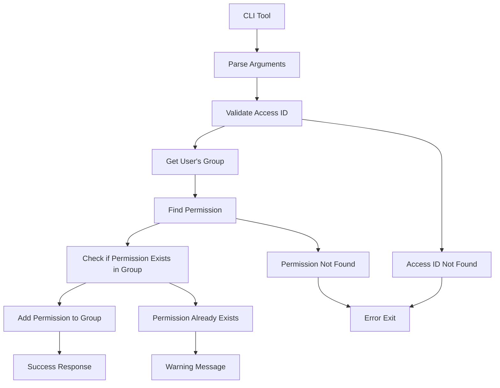
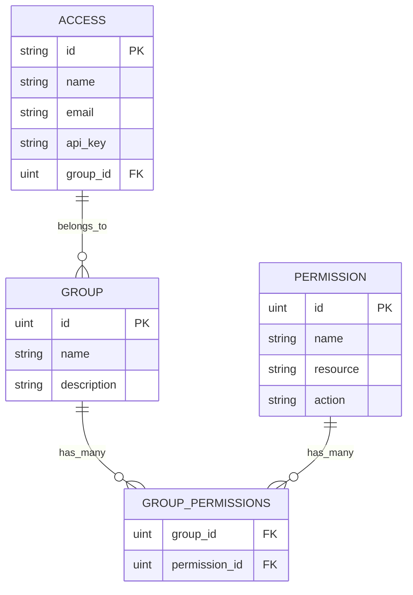

# Permission Manager CLI Tool

## Overview

A command line tool to add permissions to access IDs by managing their associated group permissions.

## Architecture



## Database Relationships



## Usage

```bash
# Basic usage
./permission-manager [access_id] [resource] [action]

# Example
./permission-manager 019847a9-4efb-72c1-92fb-2c5eab3335d1 configurations create
```

## Implementation Plan

### Phase 1: Core Structure
- [x] Analyze database schema and relationships
- [x] Design CLI tool architecture
- [ ] Create main CLI structure with argument parsing
- [ ] Implement database connection and configuration loading

### Phase 2: Business Logic
- [ ] Create functions to validate access ID exists
- [ ] Create functions to find and validate permissions by resource and action
- [ ] Create functions to check if permission already exists in group
- [ ] Implement core logic to add permission to group

### Phase 3: Polish & Testing
- [ ] Add proper error handling and user feedback
- [ ] Create build scripts for the CLI tool
- [ ] Test the tool with various scenarios
- [ ] Create documentation and usage examples

## Expected Behavior

### Success Cases
```bash
$ ./permission-manager 019847a9-4efb-72c1-92fb-2c5eab3335d1 configurations create
✓ Permission 'configurations:create' successfully added to group 'Editor' for access ID '019847a9-4efb-72c1-92fb-2c5eab3335d1'
```

### Error Cases
```bash
# Invalid access ID
$ ./permission-manager invalid-id configurations create
✗ Error: Access ID 'invalid-id' not found

# Permission not found
$ ./permission-manager 019847a9-4efb-72c1-92fb-2c5eab3335d1 invalid-resource create
✗ Error: Permission 'invalid-resource:create' not found in database

# Permission already exists
$ ./permission-manager 019847a9-4efb-72c1-92fb-2c5eab3335d1 configurations create
⚠ Warning: Permission 'configurations:create' already exists in group 'Editor'
```

## File Structure

```
cmd/
└── permission-manager/
    └── main.go
scripts/
├── build-permission-manager.sh
└── build-permission-manager.bat
docs/
└── PERMISSION-MANAGER-CLI.md
```

## Integration

The tool integrates with existing codebase:
- Uses same configuration system (`configs/config.go`)
- Leverages existing models (`access`, `permission`, `group`)
- Follows same database connection pattern (`internal/database`)